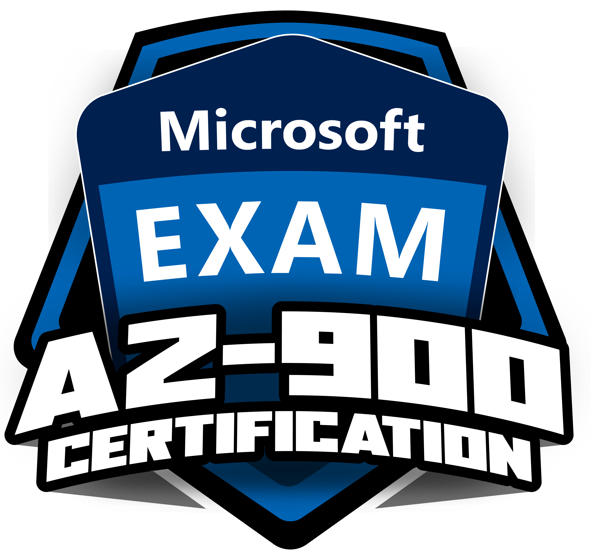

## [Dio]( [Code your global future now](https://www.dio.me/en)) Desafio Tipos de Serviço de Nuven

**Desafio DIO Formação Microsoft AZ-900 Certification**, resumo sobre os tipos de serviço de nuvem, Iaas, Saas e Paas.

## Conteúdos

- [Iaas](#iaas)

- [Paas](#pass)

- [Saas](#saas)

## Iass

    **Infraestrutura como serviço**, é a capacidade do usuário gerenciar o sistema operacional, neste modelo o usuário tem mais flexibilidade, pois possui uma maior autonomia ele possui responsábilidades sobre **informações e dados**, **dispositivos** **(móveis e PCs)**, **contas, identidades** , **infraestrutura de identidade e diretorio**, **aplicativos, controles de rede e Sistema operacional**,  agora a microsoft é responsável pela parte de infraestrutura fisíca **(Host físico, Rede física e** **Datacenter físico) .**

## Paas

    **Plataforma como serviço**, nesta plataforma você não é responsável pelo sistema operacional, o usuário se quer tem acesso ao sistema operacional, ele somente utiliza da plataforma as ferramentas para os desenvolvedores, eles fazerm análise de negócios, gerenciamento de database, deploy. O plataforma como serviço oferece um ambiente de criação, por exemplo ambiente de Dev, QA, Homologação produção para implementaçã de softwares.  

    Neste modelo o usuário tem a responsábilidade sobre as **informações e dados**,

**dispositivos (moveis e PCs )** e **contas e identidades**, existe a reponsábilidade compartilhada na **infraestrutura de identidade e diretorio**, **aplicativos e controles de rede**, o **Sitema operacional Hosts físicos, Rede física e Datacenter físico**, são de responsabilidade da microsoft.

## Saas

    Software como serviço, ele é a capacidade de utilizar o serviço do software, como o dropbox, o gmail, você consome os serviços destes softwares.

    No modelo Saas, o usuário tem a responsábilidade sobre as **informações e dados** , **dispositivos ( móveis e PCs) e contas e identidades**, a i**nfraestrutura de identidade**  **e** **diretórios** são de responsabilidade compartilhada, **aplicativo, controles de rede, sistema operacional, hosts físicos, rede física e Datacenter** **físico** são de responsábilidade da microsoft.

<a href="www.linkedin.com/in/lincolntec">
 
  
</a>

🚀

Desenvolvido por <b>[Alcino José Lincoln de Souza](www.linkedin.com/in/lincolntec)</b> 👋🏽 Entre em contato!
